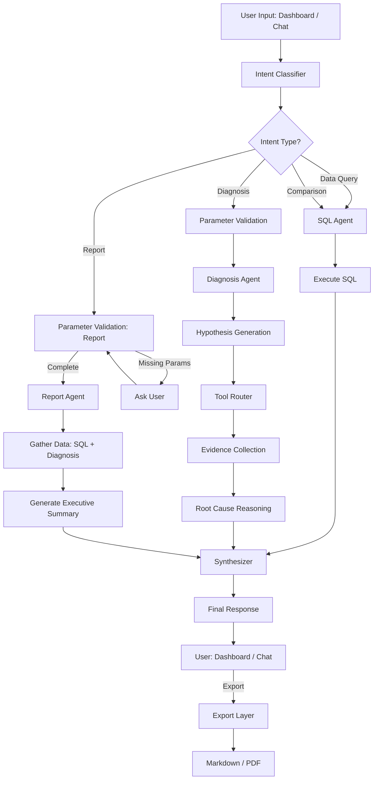
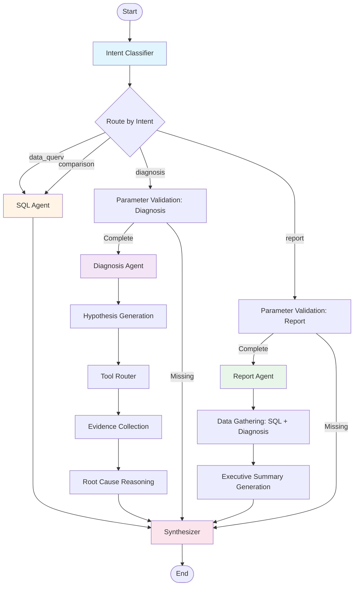

# SignalPilot

> **AI Business Intelligence Agent for Cross-border E-commerce**
>
> 让业务洞察从"数小时人工分析"变为"数分钟自然对话" — 从异常发现到根因诊断，从数据查询到智能报告，一站式 AI 驱动的业务分析平台。

---

## 🎯 产品定位

**SignalPilot** 是一个面向跨境电商业务的 **AI Business Intelligence Agent**，通过多 Agent 协作自动完成从异常监控、根因诊断到业务报告生成的完整分析闭环。

**核心能力**:
- 🤖 **Multi-Agent Orchestration**: Intent Classifier → SQL Agent → Diagnosis Agent → Report Agent 智能协作
- 💬 **Natural Language Interface**: 用自然语言提问，AI 自动生成 SQL、执行查询、分析结果
- 🔍 **Root Cause Analysis**: 基于假设驱动的诊断框架，自动识别异常根因（品类下降、流量问题、转化率异常等）
- 📊 **Executive Summary Generation**: 自动生成业务周报/月报/季报，输出高管级别的 Executive Summary
- 📤 **Multi-Format Export**: 支持 Markdown、PDF 导出，一键分享业务洞察
- 📈 **Real-time Dashboard**: KPI 监控、趋势可视化、异常告警，点击即可触发深度诊断

---

## 📖 项目背景

这个项目的灵感来自于我在 **eBay 中国分析中心 (CBT Business Analytics)** 的实习经历。

在实习期间，我观察到业务分析的典型流程：

```
业务问题 → SQL 查询 → Tableau 可视化 → 手动分析 → PPT 报告
总耗时：4-8 小时
```

### 核心痛点

**业务侧**:
- ⏱️ **异常发现滞后**: 3天后才注意到 GMV 下降，已损失数十万美元
- 🔍 **根因分析耗时**: 从品类、流量、转化率逐层下钻，需要 4-6 小时
- 📊 **报告制作繁琐**: 周报/月报需要手动提取数据、编写分析、制作 PPT

**技术侧**:
- 🗄️ **SQL 门槛高**: 业务人员依赖分析师，响应周期 1-2 天
- 🧩 **工具碎片化**: Salesforce + Tableau + Excel + Slack，数据散落各处
- 🔄 **重复劳动**: 相似的查询和分析每周重复，缺乏自动化

### SignalPilot 的解决方案

通过 **Multi-Agent Orchestration** 和 **LLM-powered Workflow**，将业务分析流程从"人工主导"转变为"AI 驱动"：

```
自然语言提问 → AI Agent 自动分析 → 生成洞察报告
总耗时：2-5 分钟（缩短 95%）
```

---

## ✨ 核心功能

### 1. 📊 Real-time Dashboard

**业务监控驾驶舱**，一览核心指标和异常信号：

- **KPI Cards**: GMV、订单量、转化率、客单价实时监控，显示环比变化
- **Multi-Trend Chart**: 多维度趋势对比（站点、品类、时间区间）
- **Anomaly Alerts**: 自动检测异常指标，按 severity 分级告警
- **One-Click Diagnosis**: 点击异常卡片，触发 Diagnosis Agent 深度分析
- **Export Report**: 一键生成业务月报，复用当前筛选条件

### 2. 💬 AI Chat Agent

**自然语言业务分析助手**，无需 SQL 即可查询数据：

- **Intent Classification**: 自动识别意图（数据查询、对比分析、诊断、报告生成）
- **Entity Extraction**: 提取站点、品类、时间范围等业务实体
- **SQL Generation**: 基于 Schema 自动生成 DuckDB 查询
- **Multi-turn Conversation**: 支持上下文追问，逐步细化分析需求

**示例对话**:
```
用户: 德国站上周 GMV 是多少？
AI: [生成 SQL → 执行查询] 德国站上周 GMV 为 $1,234,567，环比上升 5.2%

用户: 和法国站对比呢？
AI: [对比分析] 德国站 GMV 比法国站高 23%，主要由于...
```

### 3. 🔍 Diagnosis Agent

**智能根因分析引擎**，自动定位业务异常原因：

- **Hypothesis Generation**: 基于异常类型（GMV 下降、订单下降、CVR 异常），生成诊断假设
- **Evidence Collection**: 调用 Tool Calling（品类下钻、流量分析、转化率细分、对比分析）
- **Root Cause Reasoning**: 基于 Evidence 推理根因，输出置信度和优先级
- **Diagnosis Report**: 生成结构化诊断报告（根因、影响贡献度、建议行动）

**支持的诊断场景**:
- 📉 GMV 下降 → 品类问题 / 流量下降 / 转化率异常
- 📦 订单量异常 → 流量变化 / 商品库存 / 促销活动
- 💰 客单价波动 → 高价商品占比 / 品类结构变化

### 4. 📝 Report Agent

**自动业务报告生成器**，输出高管级别的 Executive Summary：

- **Multi-Type Reports**: 周报 / 月报 / 季报 / 自定义时间区间
- **Automatic Data Gathering**: 调用 SQL Agent 获取 KPI、趋势、异常
- **Integrated Diagnosis**: 检测到异常时自动触发 Diagnosis Agent，将根因分析纳入报告
- **Executive Summary**: 基于 Claude API 生成结构化摘要（概览、关键发现、趋势、建议）
- **Parameter Validation**: Chat 提问时自动询问缺失参数（站点、时间范围），Dashboard 直接传参跳过

**报告结构**:
```markdown
# 业务月报

**站点**: DE  
**时间范围**: 2026-06-01 ~ 2026-06-30

## 概览
德国站本月 GMV 为 $X，环比增长 Y%，主要驱动因素为...

## 关键发现
- GMV 增长主要来自电子品类（+15%）
- 订单量下降 5%，但客单价提升 12%
- 转化率稳定在 2.8%，略高于平均水平

## 趋势
- 月初流量高峰，中旬回落...

## 建议
- 加大电子品类广告投放
- 优化高客单价商品详情页
```

### 5. 📤 Export Layer

**多格式导出**，支持业务报告分享：

- **Markdown Export**: 一键下载 `.md` 文件，适合 GitHub / 内部 Wiki
- **PDF Export**: 生成 PDF 报告，适合高管汇报和邮件分享
- **Structured Data**: 导出 JSON 格式，支持二次分析

### 6. 🧠 Tool Calling & Function Calling

**工具调用框架**，支持 Agent 动态执行外部操作：

- **SQL Tool**: 执行 SQL 查询，获取业务数据
- **Category Breakdown Tool**: 品类下钻分析
- **Traffic Analysis Tool**: 流量来源分析
- **Conversion Funnel Tool**: 转化漏斗分析
- **Comparison Tool**: 站点/品类对比分析

所有 Tool 返回结构化数据，供 Diagnosis Agent 和 Report Agent 消费。

---

## 🔄 Overall Agent Workflow

完整的业务分析闭环，从用户输入到生成报告的全流程：



**关键节点说明**:

1. **Intent Classifier**: 识别用户意图（Data Query、Comparison、Diagnosis、Report Generation）
2. **Parameter Validation**: 针对 Diagnosis 和 Report，验证必需参数（站点、时间范围），缺失则向用户追问
3. **SQL Agent**: 基于 Schema 生成 SQL，执行查询，返回结构化数据
4. **Diagnosis Agent**: 假设驱动诊断 → Tool Calling → Evidence Collection → Root Cause Reasoning
5. **Report Agent**: 数据采集（SQL + Diagnosis）→ LLM 生成 Executive Summary
6. **Synthesizer**: 统一格式化响应，返回给用户
7. **Export Layer**: 支持 Markdown / PDF 导出

---

## 🏗️ LangGraph Architecture

基于 **LangGraph** 的 Agent 编排架构，实现多 Agent 协作和条件路由：



**核心设计原则**:

1. **Intent-based Routing**: 根据意图动态路由到不同 Agent
2. **Parameter Validation Gate**: Diagnosis 和 Report 前置参数校验，避免"默默失败"
3. **Tool Calling Pattern**: Diagnosis Agent 基于假设动态选择 Tool
4. **Data Reuse**: Report Agent 复用 SQL Agent 和 Diagnosis Agent 的产出
5. **Unified Response**: Synthesizer 统一格式化所有响应，保证前端一致性

---

## 🛠️ Tech Stack

| Layer | Technology | Purpose |
|-------|-----------|---------|
| **Frontend** | Next.js 16 + TypeScript + Tailwind CSS | Dashboard UI + Chat Interface |
| **Backend** | FastAPI + Python 3.11 | API Gateway + Agent Orchestration |
| **Agent Framework** | LangGraph + LangChain | Multi-Agent Workflow Engine |
| **LLM** | Claude Sonnet 4.5 (Anthropic API) | Intent Classification, SQL Generation, Diagnosis Reasoning, Report Generation |
| **Database** | DuckDB | OLAP Query Engine (Mock Data) |
| **Visualization** | Recharts | KPI Cards + Trend Charts |
| **Export** | ReportLab (PDF), Markdown | Business Report Export |

---

## 📸 Demo Scenarios

### Scenario 1: 自然语言数据查询

**用户**: "德国站过去7天的 GMV 是多少？"

**AI Agent 执行流程**:
1. Intent Classifier → `data_query`
2. Entity Extraction → `site: DE`, `days: 7`, `metric: GMV`
3. SQL Agent → 生成 SQL:
   ```sql
   SELECT SUM(gmv) as total_gmv 
   FROM daily_agg 
   WHERE site = 'DE' AND date >= CURRENT_DATE - 7
   ```
4. Execute SQL → 返回结果
5. Synthesizer → "德国站过去7天 GMV 为 $1,234,567"

### Scenario 2: 异常诊断

**用户**: 在 Dashboard 点击 "GMV 下降 15%" 的异常卡片

**AI Agent 执行流程**:
1. Intent Classifier → `diagnosis`
2. Parameter Validation → `site: DE`, `date: 2026-07-10`, `metric: GMV` (从异常卡片传入)
3. Diagnosis Agent → Hypothesis Generation:
   - 假设1: 品类下降
   - 假设2: 流量下降
   - 假设3: 转化率异常
4. Tool Router → 选择 `category_breakdown`, `traffic_analysis`
5. Evidence Collection → 执行 Tool，收集证据
6. Root Cause Reasoning → "根因: Electronics 品类 GMV 下降 25%，贡献 80% 的总体下降"
7. Synthesizer → 返回诊断报告（根因、影响、建议）

### Scenario 3: 业务报告生成

**用户 (Chat)**: "生成德国站本月业务报告"

**AI Agent 执行流程**:
1. Intent Classifier → `report_generation`
2. Parameter Validation → `site: DE`, `start_date: 2026-07-01`, `end_date: 2026-07-31` (自动推断)
3. Report Agent → Data Gathering:
   - 调用 SQL Agent 获取 KPI、趋势
   - 检测异常 → 自动触发 Diagnosis Agent 获取根因
4. Executive Summary Generation → Claude API 生成摘要
5. Synthesizer → 返回报告 (含 Executive Summary + KPI + Diagnosis)
6. Frontend → 展示报告 + 提供 Download Markdown / PDF

**用户 (Dashboard)**: 点击 "Export Report" 按钮 → 选择 Year + Month → 生成月报

**区别**: Dashboard 跳过 Parameter Validation（参数从筛选条件继承），直接调用 Report Agent。

---

## 🚀 Quick Start

### Prerequisites

- Python 3.11+
- Node.js 18+
- Anthropic API Key (Claude)

### Installation

1. Clone the repository:
```bash
git clone https://github.com/yourusername/business-signal-pilot.git
cd business-signal-pilot
```

2. Backend Setup:
```bash
cd backend
pip install -r requirements.txt

# 配置环境变量
cp .env.example .env
# 编辑 .env，填入 ANTHROPIC_API_KEY
```

3. Frontend Setup:
```bash
cd frontend
npm install

# 配置环境变量
cp .env.local.example .env.local
# 编辑 .env.local，填入 NEXT_PUBLIC_API_URL
```

4. Initialize Database (Mock Data):
```bash
cd backend
python scripts/init_db.py  # 生成 Mock 数据
```

5. Run:
```bash
# Terminal 1: Backend
cd backend
uvicorn app.main:app --reload --port 8000

# Terminal 2: Frontend
cd frontend
npm run dev
```

6. Open: http://localhost:3000

---

## 📦 Real-world Deployment

**当前状态**: 本项目使用 **DuckDB + Mock Data**，仅用于 **Demo 和 POC**。

**生产环境部署建议**:

### 数据源集成

替换 DuckDB Mock Data，接入真实业务数据：

| 数据源 | 用途 | 集成方式 |
|--------|------|---------|
| **Salesforce** | 订单、客户、销售数据 | Salesforce API / ODBC Connector |
| **Amazon SP API** | Amazon 站点销售数据 | SP-API SDK |
| **Shopify** | Shopify 站点订单数据 | Shopify Admin API |
| **Google Analytics** | 流量、转化数据 | GA4 API |
| **Snowflake / Redshift** | 数据仓库 | ODBC / SQLAlchemy |
| **Tableau / Looker** | 现有 BI 数据 | REST API / Embedded Analytics |

### 架构升级

```
Current: Next.js → FastAPI → DuckDB (In-Memory)
Production: Next.js → FastAPI → [Data Layer] → Snowflake / Redshift
                              ↓
                        [Cache Layer: Redis]
                              ↓
                        [Agent Framework: LangGraph]
                              ↓
                        [LLM: Claude API / Self-hosted LLM]
```

**关键变更**:
1. **Database**: DuckDB → Snowflake / Redshift / PostgreSQL
2. **SQL Agent**: 适配新的 Schema 和方言（Snowflake SQL / PostgreSQL）
3. **Cache**: 引入 Redis 缓存高频查询结果
4. **Authentication**: 添加用户认证和权限管理
5. **Monitoring**: 集成 Datadog / New Relic 监控 Agent 性能

---

## 🗺️ Roadmap

### Phase 5: Policy RAG (In Progress)

- [ ] **Policy Document Ingestion**: 上传业务政策文档（Markdown / PDF）
- [ ] **Vector Store**: 使用 Pinecone / Milvus 存储 Policy Embeddings
- [ ] **RAG Agent**: 基于 Policy 文档回答业务规则问题
- [ ] **Policy-guided Diagnosis**: 诊断时引用相关 Policy，给出合规建议

### Phase 6: Advanced Features

- [ ] **Dashboard Diagnosis Export**: Dashboard 点击异常 → 直接导出诊断报告（PDF）
- [ ] **Scheduled Reports**: 定时生成周报/月报，自动发送邮件/Slack
- [ ] **Multi-site Comparison**: 多站点横向对比分析
- [ ] **Forecasting Agent**: 基于历史数据预测未来趋势
- [ ] **Alert Subscription**: 用户订阅关键指标告警

### Phase 7: Data Source Expansion

- [ ] **Salesforce Integration**: 接入真实 Salesforce 数据
- [ ] **Amazon SP API**: 支持 Amazon 站点数据
- [ ] **Shopify API**: 支持 Shopify 站点数据
- [ ] **Google Analytics 4**: 集成 GA4 流量数据

### Phase 8: Self-hosted LLM

- [ ] **Llama 3 / Qwen 2.5**: 支持私有化部署 LLM
- [ ] **vLLM / TGI**: 推理加速
- [ ] **Cost Optimization**: 降低 Claude API 调用成本

---

## 🎯 Highlights

### 1. Multi-Agent Orchestration

- **LangGraph-powered Workflow**: Intent Classifier → SQL Agent → Diagnosis Agent → Report Agent 智能协作
- **Conditional Routing**: 根据意图和参数动态路由到不同 Agent
- **Tool Calling**: Diagnosis Agent 基于假设动态选择 Tool（品类下钻、流量分析等）

### 2. Hypothesis-Driven Diagnosis

- **Structured Hypothesis**: 基于异常类型生成诊断假设（而非"黑盒"推理）
- **Evidence-based Reasoning**: 收集证据 → 验证假设 → 输出根因和置信度
- **Actionable Insights**: 提供具体的业务建议（而非"GMV 下降了"）

### 3. Natural Language to SQL

- **Schema-aware Generation**: 基于 Database Schema 生成正确的 SQL
- **Entity Extraction**: 自动识别站点、品类、时间范围等业务实体
- **Multi-turn Context**: 支持上下文追问（"和法国站对比呢？"）

### 4. Executive Summary Generation

- **LLM-powered Summarization**: Claude API 生成高管级别的业务摘要
- **Integrated Diagnosis**: 异常自动关联根因分析
- **Multi-format Export**: Markdown / PDF 一键导出

### 5. Real-time + Proactive

- **Dashboard Monitoring**: KPI 实时监控 + 异常告警
- **One-Click Diagnosis**: 点击异常 → 自动触发诊断
- **Scheduled Reports**: (Roadmap) 定时生成报告，主动推送

---

## 🧪 Testing

### Backend Tests

```bash
cd backend
pytest tests/ -v

# 测试覆盖率
pytest tests/ --cov=app --cov-report=html
```

**核心测试文件**:
- `test_orchestrator_v2.py`: Orchestrator Workflow 端到端测试
- `test_diagnosis.py`: Diagnosis Agent 单元测试
- `test_phase4_report.py`: Report Agent 集成测试

### Frontend Tests

```bash
cd frontend
npm run test

# E2E 测试 (TODO)
npm run test:e2e
```

---

## 📚 Documentation

- [Phase 4 Implementation Summary](docs/PHASE4_IMPLEMENTATION_SUMMARY.md): Report Agent 实现细节
- [Dashboard Report Integration](docs/DASHBOARD_REPORT_INTEGRATION.md): Dashboard Export Report 集成说明
- [API Documentation](http://localhost:8000/docs): FastAPI 自动生成的 API 文档

---

## 🤝 Contributing

欢迎贡献代码、提出 Issue 或 Feature Request！

1. Fork 本仓库
2. 创建 feature 分支 (`git checkout -b feature/AmazingFeature`)
3. 提交更改 (`git commit -m 'Add some AmazingFeature'`)
4. 推送到分支 (`git push origin feature/AmazingFeature`)
5. 开启 Pull Request

**代码规范**:
- Backend: PEP 8 (使用 `black` 格式化)
- Frontend: ESLint + Prettier
- Commit Message: 遵循 Conventional Commits

---

## 🙏 Acknowledgements

- [Anthropic](https://www.anthropic.com/) - Claude API
- [LangGraph](https://langchain-ai.github.io/langgraph/) - Agent Orchestration Framework
- [FastAPI](https://fastapi.tiangolo.com/) - Modern Python Web Framework
- [Next.js](https://nextjs.org/) - The React Framework
- [DuckDB](https://duckdb.org/) - In-Process OLAP Database
- eBay China Analytics Team - 灵感来源

---

**Built with ❤️ for AI-powered Business Intelligence**

如果这个项目对你有帮助，请给个 ⭐️ Star！

---