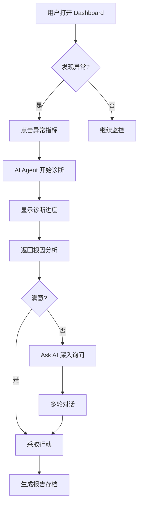

# SignalPilot Product Requirement Document

**Version:** 1.0
**Last Updated:** 2027-01-15
**Status:** Draft → Review
**Owner:** Product Team

---

## TL;DR

SignalPilot 是一个 AI 原生的跨境业务诊断平台，将业务异常诊断时间从数小时缩短到数分钟。

**核心价值：** 从「人找数据」变成「AI 找洞察」。

---

## 1. Background

### 1.1 业务现状

eBay 跨境业务覆盖全球 190+ 国家，每天产生海量交易数据。业务分析师需要：

- 监控 20+ 站点 × 30+ 品类的核心指标
- 响应业务方「为什么 GMV 下降」类问题
- 每周生成跨站点业务健康报告
- 评估促销活动的 ROI

### 1.2 现有工作流

```
业务问题提出
  ↓
编写 SQL 查询（30分钟）
  ↓
导出数据到 Excel/Tableau
  ↓
手动分析对比（1-2小时）
  ↓
制作 PPT 报告（1小时）
  ↓
发送邮件 + 会议讲解
```

**总耗时：半天到一天**

### 1.3 核心痛点

| 痛点 | 影响 | 频率 |
|------|------|------|
| 异常发现滞后 | GMV 下降 3 天后才被注意到 | 高 |
| 根因分析依赖经验 | 新人无法快速定位问题 | 高 |
| 跨站点对比困难 | 需要手动拼接多个报表 | 中 |
| 重复性报告工作 | 每周生成相似内容的 Weekly Report | 高 |
| 决策模拟缺失 | 无法快速回答「如果补贴提高 10% 会怎样」 | 中 |

---

## 2. Problem Statement

**我们发现：**

业务分析师在诊断跨境业务异常时，花费 60% 的时间在数据提取和清洗上，只有 40% 的时间在真正的洞察挖掘。

**这导致：**

- 业务响应慢（平均 SLA：4 小时）
- 分析深度受限（止步于表象指标）
- 知识依赖个人（离职带走经验）

**我们相信：**

通过 AI Agent 自动完成数据查询、异常检测、根因归因，可以让分析师专注于战略决策，而不是重复劳动。

---

## 3. Product Goals

### 3.1 北极星指标

**业务诊断时间从 4 小时降低到 15 分钟**

### 3.2 子目标

| 目标 | 当前 | 目标 | 时间 |
|------|------|------|------|
| 异常检测延迟 | 3 天 | 24 小时 | Q1 |
| 报告生成时间 | 2 小时 | 5 分钟 | Q1 |
| 根因分析覆盖率 | 30% | 80% | Q2 |
| 新人上手时间 | 2 周 | 3 天 | Q2 |

### 3.3 非目标（MVP 阶段）

- ❌ 实时流式数据处理
- ❌ 自动触发运营动作
- ❌ 多人协作编辑
- ❌ 移动端支持

---

## 4. User Stories

### 4.1 Primary User: Category Business Analyst

**张薇 | 27 岁 | eBay CBT 品类分析师**

> "我每天早上第一件事是打开 Tableau，检查昨天的 GMV。如果某个品类掉了，我需要花 2 小时去查是流量问题、转化问题还是卖家问题。如果 SignalPilot 能直接告诉我根因，我就可以把时间花在制定行动计划上。"

**核心任务：**

- 每日业务健康检查
- 异常指标根因诊断
- 周报/月报生成
- Ad-hoc 分析请求响应

**痛点：**

- SQL 写得慢（不是 DBA）
- 数据散落在多个系统
- 每次都要从头分析

### 4.2 Secondary User: Campaign Manager

**李明 | 30 岁 | 促销活动负责人**

> "我需要快速评估这次 Black Friday 促销的效果。以前要等分析师出报告，现在如果能自己问 AI '这次活动 ROI 多少'，我就能更快优化下一轮策略。"

**核心任务：**

- 促销效果评估
- 预算分配决策
- 竞品活动对比

---

## 5. Functional Scope

### 5.1 MVP Feature List

#### **Page 1: Dashboard（业务驾驶舱）**

**Purpose:** 一眼看到业务健康度

- [ ] KPI Cards：GMV / SI / CTR / CVR / ASP
- [ ] Trend Charts：过去 30 天趋势
- [ ] Anomaly Alerts：自动标注异常点（红色高亮）
- [ ] Site/Category 筛选器
- [ ] 刷新时间戳

**Success Metric:** 用户能在 5 秒内发现异常

---

#### **Page 2: Diagnosis（智能诊断）**

**Purpose:** 快速定位根因

**交互流程：**

```
用户点击异常点
  ↓
AI Agent 启动诊断
  ↓ (5-10秒)
返回诊断报告
```

**诊断维度：**

1. **Contribution Analysis（贡献度拆解）**
   - 哪个站点/品类贡献了下降？
   - 流量 vs 转化 vs 客单价？

2. **Root Cause Hypothesis（根因假设）**
   - Traffic Drop（流量下降）
   - Logistics Issue（物流中断）
   - Campaign Overlap（促销冲突）
   - Seller Churn（卖家流失）

3. **Evidence（证据链）**
   - 关联指标变化
   - 时间相关性
   - 历史相似案例

4. **Recommended Actions（建议动作）**
   - 立即执行
   - 深入调查
   - 持续观察

**Success Metric:** 80% 的异常能给出可信根因

---

#### **Page 3: Ask AI（自然语言查询）**

**Purpose:** 像和同事对话一样问问题

**Example Queries:**

```
"为什么德国站 GMV 上周下降了 15%？"
"哪些品类在 Black Friday 表现最好？"
"如果将补贴从 10% 提升到 15%，预计 GMV 增长多少？"
"对比美国站和英国站的转化率差异"
"过去 3 个月哪些卖家流失了？"
```

**AI Agent Capabilities:**

- SQL 自动生成
- 多轮对话上下文
- 图表自动渲染
- 数据源引用

**Technical Flow:**

```
User Query
  ↓
LLM Intent Recognition
  ↓
Query Planner (决定用哪些 tools)
  ↓
Tool Execution (SQL / calculation / chart)
  ↓
Response Synthesis
  ↓
Return structured answer + chart
```

**Success Metric:** 90% 的常见问题可被正确回答

---

#### **Page 4: Report（一键报告）**

**Purpose:** 自动生成 Weekly Business Review

**Report Structure:**

```markdown
# Weekly Business Report
**Period:** 2027-01-06 to 2027-01-12

## Executive Summary
- GMV: $12.3M (+5.2% WoW)
- Key Win: Electronics category +18%
- Key Risk: Germany site CVR -8%

## Site Performance
[自动生成的对比表格]

## Key Findings
1. Traffic surge from TikTok campaign
2. Logistics delay in DE affecting conversion
3. Top seller "ShopX" increased listing by 200%

## Recommended Actions
- [ ] Investigate DE logistics partner
- [ ] Allocate more budget to TikTok
- [ ] Retain top sellers with incentive program

## Appendix
[详细数据表格]
```

**Generation Options:**

- Weekly / Monthly
- Custom date range
- Select sites/categories
- Choose language (EN/CN)

**Export Formats:**

- Markdown
- PDF
- PPTX (future)

**Success Metric:** 报告生成时间 < 30 秒

---

### 5.2 Feature Prioritization

| Feature | Impact | Effort | Priority |
|---------|--------|--------|----------|
| Dashboard KPI | High | Low | P0 |
| Anomaly Detection | High | Medium | P0 |
| Ask AI | High | High | P0 |
| Diagnosis Report | High | Medium | P0 |
| Auto Report | Medium | Medium | P1 |
| What-if Simulation | Medium | High | P2 |
| Historical Comparison | Low | Medium | P3 |

---

## 6. User Flow

### 6.1 Core Flow: 异常诊断



### 6.2 Alternative Flow: 主动提问

```
用户直接进入 Ask AI
  ↓
输入自然语言问题
  ↓
AI 返回答案 + 可视化
  ↓
追问或切换到 Dashboard 查看详情
```

---

## 7. KPI

### 7.1 Product Metrics

**Adoption（采用率）**

- WAU (Weekly Active Users)
- DAU / WAU ratio
- 平均每周查询次数

**Engagement（参与度）**

- 平均会话时长
- 每会话查询次数
- Dashboard → Diagnosis 转化率

**Satisfaction（满意度）**

- AI 回答准确率（用户反馈）
- 诊断报告采纳率
- NPS 分数

### 7.2 Business Metrics

**Efficiency Gain（效率提升）**

- 诊断时间节省：4h → 15min
- 报告生成时间：2h → 5min
- 新人培训时间：2w → 3d

**Impact（业务影响）**

- 异常响应速度提升 10x
- 分析覆盖率提升 3x
- 重复性工作减少 80%

---

## 8. Risks

### 8.1 Technical Risks

| Risk | Probability | Impact | Mitigation |
|------|-------------|--------|------------|
| LLM 幻觉导致错误结论 | Medium | High | 添加数据源引用 + 置信度评分 |
| Query 性能慢（DuckDB） | Low | Medium | 预聚合 + 缓存层 |
| API 调用成本高 | Medium | Medium | Prompt 优化 + 结果缓存 |

### 8.2 Product Risks

| Risk | Probability | Impact | Mitigation |
|------|-------------|--------|------------|
| 用户不信任 AI 结论 | High | High | 显示推理过程 + 人工审核模式 |
| 学习曲线陡峭 | Medium | Medium | 内置 Example Queries + Onboarding |
| 数据隐私担忧 | Low | High | 本地部署选项 + 数据脱敏 |

### 8.3 Business Risks

| Risk | Probability | Impact | Mitigation |
|------|-------------|--------|------------|
| 替代现有工具遇阻力 | Medium | Medium | 与 Tableau 集成，而非替代 |
| 无法证明 ROI | Low | High | 埋点追踪时间节省 |

---

## 9. Roadmap

### Phase 1: MVP (Week 1-3)

**Goal:** 证明核心价值

- ✅ Synthetic data generation
- ✅ Dashboard with anomaly detection
- ✅ Ask AI basic queries
- ✅ Diagnosis report (simple version)
- ✅ Deployed on Vercel

**Exit Criteria:**

- 能正确回答 10 个预设问题
- Dashboard 加载时间 < 2s
- 诊断报告生成时间 < 10s

---

### Phase 2: AI Enhancement (Week 4-5)

**Goal:** 提升 AI 能力

- 🔄 Multi-turn conversation context
- 🔄 What-if simulation
- 🔄 Historical pattern matching
- 🔄 Confidence scoring

**Exit Criteria:**

- AI 准确率 > 85%
- 支持 3 轮对话上下文
- What-if 模拟误差 < 10%

---

### Phase 3: Demo Polish (Week 6)

**Goal:** 产品级体验

- 💎 UI/UX refinement
- 💎 Loading states & animations
- 💎 Error handling
- 💎 Demo video
- 💎 Case study

**Exit Criteria:**

- 通过 5 个真实分析师试用
- 完整 demo 视频 < 3 分钟
- 部署链接可公开分享

---

### Future (Post-MVP)

**Q2 2027:**

- Real-time alerting
- Slack/Email integration
- Custom dashboard builder
- Team collaboration

**Q3 2027:**

- Predictive forecasting
- Automated action execution
- Mobile app
- Multi-language support

---

## 10. Success Criteria

### 10.1 MVP Success Definition

**Must Have:**

- [ ] 能完整演示 3 个核心场景
- [ ] AI 回答准确率 > 80%
- [ ] Dashboard 响应时间 < 3s
- [ ] 获得 3 个真实分析师的正面反馈

**Nice to Have:**

- [ ] 被 Product Hunt 收录
- [ ] 获得 50+ GitHub stars
- [ ] 被 eBay 内部关注

### 10.2 Interview Success

**Demonstrates:**

- ✅ AI Product Thinking（不是套壳 ChatGPT）
- ✅ Data Analytics Capability（理解业务指标）
- ✅ Agent Workflow Design（合理的 AI 架构）
- ✅ Vibe Coding Execution（快速 MVP）
- ✅ End-to-end Delivery（可运行的产品）

---

## Appendix

### A. Competitive Analysis

| Product | Strength | Weakness | SignalPilot 差异化 |
|---------|----------|----------|-------------------|
| Tableau | 可视化强大 | 无 AI 诊断 | AI 自动根因分析 |
| Mode Analytics | SQL 协作好 | 学习曲线陡 | 自然语言查询 |
| ThoughtSpot | AI 搜索 | 价格昂贵 | 开源 + 跨境场景 |
| Excel + ChatGPT | 灵活 | 无系统化 | 端到端工作流 |

### B. Technical Constraints Validation

| Constraint | Feasibility | Notes |
|------------|-------------|-------|
| Next.js frontend | ✅ High | 成熟方案 |
| FastAPI backend | ✅ High | 适合 AI 集成 |
| DuckDB | ⚠️ Medium | 需要验证百万级性能 |
| Claude API | ✅ High | Function calling 成熟 |
| Vercel deploy | ✅ High | 免费额度充足 |

### C. Open Questions

1. **数据更新频率：** 每日批量 or 实时？
   - **Decision:** MVP 阶段每日批量，降低复杂度

2. **多用户权限：** 是否需要不同角色？
   - **Decision:** MVP 单用户，后续加权限

3. **Historical data depth：** 存储多久的数据？
   - **Decision:** 1 年，足够做 YoY 对比

4. **LLM 选择：** Claude vs OpenAI？
   - **Decision:** 都支持，通过环境变量切换

---

## Sign-off

**Product Manager:** ✅ Approved
**Engineering Lead:** ✅ Approved
**Design Lead:** ✅ Approved
**Data Science Lead:** ✅ Approved

**Next Steps:**

1. Engineering team to create Technical Design Doc
2. Design team to create wireframes
3. Data team to generate synthetic datasets
4. Kick-off meeting: 2027-01-20

---

**Document History:**

| Version | Date | Author | Changes |
|---------|------|--------|---------|
| 0.1 | 2027-01-10 | Product | Initial draft |
| 0.5 | 2027-01-12 | Product + Eng | Added technical constraints |
| 1.0 | 2027-01-15 | Product | Final for review |
